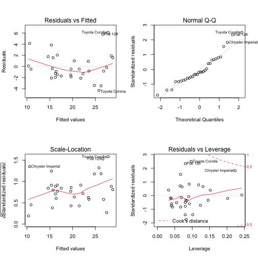
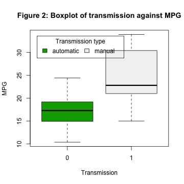

# Does transmission type affect fuel efficiency?

### Regression Models, Coursera Peer Assessment May 2015

## Executive Summary

This week Motor Trend is going to look at the affect of automatic transmissions on fuel efficiency. To do this we will use a data set that examines the fuel efficency and 10 aspects of automobile design and performance for 32 automobiles (all 1973 - 1974 models). Out of the 32 cars, 13 have manual transmissions and 19 have automatic transmissions.

In this data set on average there is a difference in fuel efficency depending on transmission type such that on average manual vehicles achieve a fuel effiency of 7.2 miles per gallon more than automatic vehicles.

However, transmission type is not a particularly good predictor of fuel efficiency. By applying analysis of variance (ANOVA) to the dataset, calculating the correlations between the variables, and building a number of models, we were able to identify that the number of cylinders and the weight of the automobile are good predictors of fuel efficiency, achieving an adjusted R squared of 0.82. If we add transmission type to this model, then the difference in fuel effiency for a manual transmission is much smaller, just 0.18 miles per gallon for a vehicle with the same weight and number of cylinders. 

Therefore we conclude that number of cylinders and weight are good predictors of fuel efficiency, but transmission type is not. 

## Method

### The data set

The data set was extracted from the 1974 edition of Motor Trend US Magazine and it deals with 1973 - 1974 models. It consists of 32 observations on 11 variables:

- `mpg`: Miles per US gallon                        
- `cyl`: Number of cylinders                      
- `disp`: Displacement (cubic inches)                    
- `hp`: Gross horsepower                         
- `drat`: Rear axle ratio                          
- `wt`: Weight (lb / 1000)                         
- `qsec`: 1 / 4 mile time                            
- `vs`: V/S                                      
- `am`: Transmission (0 = automatic, 1 = manual) 
- `gear`: Number of forward gears                  
- `carb`: Number of carburetors   

### Results

The exploratory analysis of the data is described in Appendix. Based on the exploratory analysis, we selected three models to explore the question posed by this report:


- Model 3 relates the number of cylinders and the weight to fuel efficency and achieves adjusted R squared of **0.8185**.
- Model 7 relates the type of type transmission to fuel efficiency and achieves adjusted R squared of **0.3385**.
- Model 8 relates the number of cylinders, the weight and the type of transmission to fuel effiency and achieves adjusted R squared of **0.8122**.

First we will examine the coefficients for model 3:

<!-- html table generated in R 3.0.2 by xtable 1.7-4 package -->
<!-- Sat May 23 14:52:57 2015 -->
<table border=1>
<tr> <th>  </th> <th> Estimate </th> <th> Std. Error </th> <th> t value </th> <th> Pr(&gt;|t|) </th>  </tr>
  <tr> <td align="right"> (Intercept) </td> <td align="right"> 39.6863 </td> <td align="right"> 1.7150 </td> <td align="right"> 23.14 </td> <td align="right"> 0.0000 </td> </tr>
  <tr> <td align="right"> cyl </td> <td align="right"> -1.5078 </td> <td align="right"> 0.4147 </td> <td align="right"> -3.64 </td> <td align="right"> 0.0011 </td> </tr>
  <tr> <td align="right"> wt </td> <td align="right"> -3.1910 </td> <td align="right"> 0.7569 </td> <td align="right"> -4.22 </td> <td align="right"> 0.0002 </td> </tr>
   </table>


Here we see as the number of cylinders increase, assuming weight stays the same, for one additional cylinder fuel efficiency decreases by 1.5 miles per gallon. We also see that as the weight increases by 1000 lb, assuming the number of cylinders stays the same, the fuel efficiency decreases by 3.2 miles per gallon. The intercept for fuel efficiency is 39.7 miles per gallon, for a non-existant car with 0 weight and no cylinders - the highest actual effiency car in the dataset is the Toyota Corolla which achieves 33.9 mpg. 

Second we will consider the relationship between the type of transmission and fuel efficiency in Model 7:

<!-- html table generated in R 3.0.2 by xtable 1.7-4 package -->
<!-- Sat May 23 14:52:57 2015 -->
<table border=1>
<tr> <th>  </th> <th> Estimate </th> <th> Std. Error </th> <th> t value </th> <th> Pr(&gt;|t|) </th>  </tr>
  <tr> <td align="right"> (Intercept) </td> <td align="right"> 17.1474 </td> <td align="right"> 1.1246 </td> <td align="right"> 15.25 </td> <td align="right"> 0.0000 </td> </tr>
  <tr> <td align="right"> am </td> <td align="right"> 7.2449 </td> <td align="right"> 1.7644 </td> <td align="right"> 4.11 </td> <td align="right"> 0.0003 </td> </tr>
   </table>


The coefficient for transmission indicates that cars with a manual transmission achieve a fuel effiency of 7.24 miles per gallon higher than cars with an automatic transmission. However this model using transmission achieves an adjusted R squared value of **0.3385**, which is much worse than model 3, so transmission is much poorer predictor of fuel efficiency than the number of cylinders and weight. 

Third we will consider the relationship beween type of transmission and fuel efficiency in Model 8:

<!-- html table generated in R 3.0.2 by xtable 1.7-4 package -->
<!-- Sat May 23 14:52:57 2015 -->
<table border=1>
<tr> <th>  </th> <th> Estimate </th> <th> Std. Error </th> <th> t value </th> <th> Pr(&gt;|t|) </th>  </tr>
  <tr> <td align="right"> (Intercept) </td> <td align="right"> 39.4179 </td> <td align="right"> 2.6415 </td> <td align="right"> 14.92 </td> <td align="right"> 0.0000 </td> </tr>
  <tr> <td align="right"> cyl </td> <td align="right"> -1.5102 </td> <td align="right"> 0.4223 </td> <td align="right"> -3.58 </td> <td align="right"> 0.0013 </td> </tr>
  <tr> <td align="right"> wt </td> <td align="right"> -3.1251 </td> <td align="right"> 0.9109 </td> <td align="right"> -3.43 </td> <td align="right"> 0.0019 </td> </tr>
  <tr> <td align="right"> am </td> <td align="right"> 0.1765 </td> <td align="right"> 1.3045 </td> <td align="right"> 0.14 </td> <td align="right"> 0.8933 </td> </tr>
   </table>


If we look at the coefficients, we see that compared to model 7 the coefficient for transmission type has decreased, indicating that for the same number of cylinders and car weight, this model predicts that a car with a manual transmission would achieve an improvement in fuel efficiency of just 0.18 miles per gallon over an automatic transmission. This model achieved an adjusted R squared value of **0.8122**. This is slightly worse than model 3.

Finally we will compare predictions and their confidence intervals from model 3 and model 8. We will predict the fuel efficiency in mpg for a vehicle with the mean weight and mean number of cylinders in the data set using model 3: 


```
##     fit   lwr   upr
## 1 20.09 19.16 21.02
```


Next we will predict the fuel efficency for the same vehicle, only first automatic transmission, and second with manual transmission, using model 8:


```
##     fit   lwr   upr
## 1 20.02 18.58 21.46
```

```
##    fit   lwr   upr
## 1 20.2 18.35 22.04
```


We see there is a small difference between the predictions of model 3 (20.09) and model 8 (20.2), which is much smaller than the confidence intervals. Therefore we propose the transmission type makes a negligible difference to the fuel efficiency. 

## Conclusion

Although in this data set on average manual vehicles achieve a fuel effiency of 7.2 miles per gallon more than automatic vehicles, transmission type is not a particularly good predictor of fuel efficiency. We were able to identify that the number of cylinders and the weight of the automobile are good predictors of fuel efficiency, achieving an adjusted R squared of 0.82. If we add transmission type to this model, then the difference in fuel effiency for a manual transmission is much smaller, just 0.18 miles per gallon for a vehicle with the same weight and number of cylinders. Therefore we conclude that number of cylinders and weight are good predictors of fuel efficiency, but transmission type is not. 

# Appendix - Exploratory Data Analysis

First we will use analysis of variance to investigate the relationship between fuel effiency (mpg) and the other variables:


```r
data(mtcars)
options(contrasts = c("contr.sum", "contr.poly"))
aov.1 <- aov(mpg ~ ., data = mtcars)
library(xtable)
print(xtable(aov.1), type = "html")
```

<!-- html table generated in R 3.0.2 by xtable 1.7-4 package -->
<!-- Sat May 23 14:52:57 2015 -->
<table border=1>
<tr> <th>  </th> <th> Df </th> <th> Sum Sq </th> <th> Mean Sq </th> <th> F value </th> <th> Pr(&gt;F) </th>  </tr>
  <tr> <td> cyl </td> <td align="right"> 1 </td> <td align="right"> 817.71 </td> <td align="right"> 817.71 </td> <td align="right"> 116.42 </td> <td align="right"> 0.0000 </td> </tr>
  <tr> <td> disp </td> <td align="right"> 1 </td> <td align="right"> 37.59 </td> <td align="right"> 37.59 </td> <td align="right"> 5.35 </td> <td align="right"> 0.0309 </td> </tr>
  <tr> <td> hp </td> <td align="right"> 1 </td> <td align="right"> 9.37 </td> <td align="right"> 9.37 </td> <td align="right"> 1.33 </td> <td align="right"> 0.2610 </td> </tr>
  <tr> <td> drat </td> <td align="right"> 1 </td> <td align="right"> 16.47 </td> <td align="right"> 16.47 </td> <td align="right"> 2.34 </td> <td align="right"> 0.1406 </td> </tr>
  <tr> <td> wt </td> <td align="right"> 1 </td> <td align="right"> 77.48 </td> <td align="right"> 77.48 </td> <td align="right"> 11.03 </td> <td align="right"> 0.0032 </td> </tr>
  <tr> <td> qsec </td> <td align="right"> 1 </td> <td align="right"> 3.95 </td> <td align="right"> 3.95 </td> <td align="right"> 0.56 </td> <td align="right"> 0.4617 </td> </tr>
  <tr> <td> vs </td> <td align="right"> 1 </td> <td align="right"> 0.13 </td> <td align="right"> 0.13 </td> <td align="right"> 0.02 </td> <td align="right"> 0.8932 </td> </tr>
  <tr> <td> am </td> <td align="right"> 1 </td> <td align="right"> 14.47 </td> <td align="right"> 14.47 </td> <td align="right"> 2.06 </td> <td align="right"> 0.1659 </td> </tr>
  <tr> <td> gear </td> <td align="right"> 1 </td> <td align="right"> 0.97 </td> <td align="right"> 0.97 </td> <td align="right"> 0.14 </td> <td align="right"> 0.7137 </td> </tr>
  <tr> <td> carb </td> <td align="right"> 1 </td> <td align="right"> 0.41 </td> <td align="right"> 0.41 </td> <td align="right"> 0.06 </td> <td align="right"> 0.8122 </td> </tr>
  <tr> <td> Residuals </td> <td align="right"> 21 </td> <td align="right"> 147.49 </td> <td align="right"> 7.02 </td> <td align="right">  </td> <td align="right">  </td> </tr>
   </table>


We see that the number of cylinders (cyl), the weight (wt) and the displacement (disp) are all significant at the 0.05 level. Next we will attempt to identify possible confounders by looking at the correlations between these variables:


```r
c <- cor(mtcars)
c[upper.tri(c)] <- NA
print(xtable(c), type = "html")
```

<!-- html table generated in R 3.0.2 by xtable 1.7-4 package -->
<!-- Sat May 23 14:52:57 2015 -->
<table border=1>
<tr> <th>  </th> <th> mpg </th> <th> cyl </th> <th> disp </th> <th> hp </th> <th> drat </th> <th> wt </th> <th> qsec </th> <th> vs </th> <th> am </th> <th> gear </th> <th> carb </th>  </tr>
  <tr> <td align="right"> mpg </td> <td align="right"> 1.00 </td> <td align="right">  </td> <td align="right">  </td> <td align="right">  </td> <td align="right">  </td> <td align="right">  </td> <td align="right">  </td> <td align="right">  </td> <td align="right">  </td> <td align="right">  </td> <td align="right">  </td> </tr>
  <tr> <td align="right"> cyl </td> <td align="right"> -0.85 </td> <td align="right"> 1.00 </td> <td align="right">  </td> <td align="right">  </td> <td align="right">  </td> <td align="right">  </td> <td align="right">  </td> <td align="right">  </td> <td align="right">  </td> <td align="right">  </td> <td align="right">  </td> </tr>
  <tr> <td align="right"> disp </td> <td align="right"> -0.85 </td> <td align="right"> 0.90 </td> <td align="right"> 1.00 </td> <td align="right">  </td> <td align="right">  </td> <td align="right">  </td> <td align="right">  </td> <td align="right">  </td> <td align="right">  </td> <td align="right">  </td> <td align="right">  </td> </tr>
  <tr> <td align="right"> hp </td> <td align="right"> -0.78 </td> <td align="right"> 0.83 </td> <td align="right"> 0.79 </td> <td align="right"> 1.00 </td> <td align="right">  </td> <td align="right">  </td> <td align="right">  </td> <td align="right">  </td> <td align="right">  </td> <td align="right">  </td> <td align="right">  </td> </tr>
  <tr> <td align="right"> drat </td> <td align="right"> 0.68 </td> <td align="right"> -0.70 </td> <td align="right"> -0.71 </td> <td align="right"> -0.45 </td> <td align="right"> 1.00 </td> <td align="right">  </td> <td align="right">  </td> <td align="right">  </td> <td align="right">  </td> <td align="right">  </td> <td align="right">  </td> </tr>
  <tr> <td align="right"> wt </td> <td align="right"> -0.87 </td> <td align="right"> 0.78 </td> <td align="right"> 0.89 </td> <td align="right"> 0.66 </td> <td align="right"> -0.71 </td> <td align="right"> 1.00 </td> <td align="right">  </td> <td align="right">  </td> <td align="right">  </td> <td align="right">  </td> <td align="right">  </td> </tr>
  <tr> <td align="right"> qsec </td> <td align="right"> 0.42 </td> <td align="right"> -0.59 </td> <td align="right"> -0.43 </td> <td align="right"> -0.71 </td> <td align="right"> 0.09 </td> <td align="right"> -0.17 </td> <td align="right"> 1.00 </td> <td align="right">  </td> <td align="right">  </td> <td align="right">  </td> <td align="right">  </td> </tr>
  <tr> <td align="right"> vs </td> <td align="right"> 0.66 </td> <td align="right"> -0.81 </td> <td align="right"> -0.71 </td> <td align="right"> -0.72 </td> <td align="right"> 0.44 </td> <td align="right"> -0.55 </td> <td align="right"> 0.74 </td> <td align="right"> 1.00 </td> <td align="right">  </td> <td align="right">  </td> <td align="right">  </td> </tr>
  <tr> <td align="right"> am </td> <td align="right"> 0.60 </td> <td align="right"> -0.52 </td> <td align="right"> -0.59 </td> <td align="right"> -0.24 </td> <td align="right"> 0.71 </td> <td align="right"> -0.69 </td> <td align="right"> -0.23 </td> <td align="right"> 0.17 </td> <td align="right"> 1.00 </td> <td align="right">  </td> <td align="right">  </td> </tr>
  <tr> <td align="right"> gear </td> <td align="right"> 0.48 </td> <td align="right"> -0.49 </td> <td align="right"> -0.56 </td> <td align="right"> -0.13 </td> <td align="right"> 0.70 </td> <td align="right"> -0.58 </td> <td align="right"> -0.21 </td> <td align="right"> 0.21 </td> <td align="right"> 0.79 </td> <td align="right"> 1.00 </td> <td align="right">  </td> </tr>
  <tr> <td align="right"> carb </td> <td align="right"> -0.55 </td> <td align="right"> 0.53 </td> <td align="right"> 0.39 </td> <td align="right"> 0.75 </td> <td align="right"> -0.09 </td> <td align="right"> 0.43 </td> <td align="right"> -0.66 </td> <td align="right"> -0.57 </td> <td align="right"> 0.06 </td> <td align="right"> 0.27 </td> <td align="right"> 1.00 </td> </tr>
   </table>


Here we see that there is a strong relationship between displacement and cylinders (0.9), displacement and weight (0.89) and a slightly less strong relationship between weight and cylinders (0.78). The next step is build a number of different regression models to investigate whether these variables can be used to predict fuel efficency.

### Fitting multiple regression models

Next we build a number of models, using combinations of the variables we identified in the previous section:


```r
fit1 <- lm(mpg ~ cyl, data = mtcars)
fit2 <- lm(mpg ~ wt, data = mtcars)
fit3 <- lm(mpg ~ cyl + wt, data = mtcars)
fit4 <- lm(mpg ~ disp, data = mtcars)
fit5 <- lm(mpg ~ disp + cyl, data = mtcars)
fit6 <- lm(mpg ~ disp + cyl + wt, data = mtcars)
```


The models achieve the following adjusted R squared values:

- Model 1: Cylinders to fuel efficiency **0.7171**.
- Model 2: Weight to fuel efficiency **0.7446**.
- Model 3: Cylinders and weight to fuel efficiency **0.8185**.
- Model 4: Displacement to fuel efficiency **0.709**.
- Model 5: Displacement and cylinders to fuel efficiency **0.743**.
- Model 6: Displacement, cylinders and weight to fuel efficiency **0.8147**.

Clearly model 3 has the best adjusted R squared value, and even though model 6 has an additional term, displacement, it achieves a slightly lower adjusted R squared value. This agrees with our previous analysis that although cylinders, weight and displacement all have a signficant relationship to fuel efficency, displacment is strongly related to cylinders and weight so is a confounder and does not impart any additional information.

Next we check the diagnostic plots of the residuals for model 3. 


```r
par(mfrow = c(2, 2))
plot(fit3)
```

 

#### Figure 1: Diagnostic plots of residuals for model 3

The plots show that there are a see a number of outliers in the dataset, specifically the Toyota Corolla, Toyota Corona, Fiat 128 and Chrysler Imperial. The Toyota Corolla and Fiat 128 achieve a very high fuel efficiency (33.9 and 32.4 mpg respectively), whereas the Imperial has low fuel efficency (14.7 mpg). The Toyota Corona achieves medium fuel efficiency (24.9 mpg). 

Now we will consider the relationship between the type of transmission and fuel efficiency:


```r
boxplot(mpg ~ am, data = mtcars, xlab = "Transmission", ylab = "MPG", col = terrain.colors(2))
title(main = "Figure 2: Boxplot of transmission against MPG")
legend("topleft", inset = 0.05, title = "Transmission type", c("automatic", 
    "manual"), fill = terrain.colors(2), horiz = TRUE)
```

 


Figure 2 shows that on average there is a difference between the fuel efficiency depending on transmission type. 


```r
fit7 <- lm(mpg ~ am, data = mtcars)
print(xtable(fit7), type = "html")
```

<!-- html table generated in R 3.0.2 by xtable 1.7-4 package -->
<!-- Sat May 23 14:52:57 2015 -->
<table border=1>
<tr> <th>  </th> <th> Estimate </th> <th> Std. Error </th> <th> t value </th> <th> Pr(&gt;|t|) </th>  </tr>
  <tr> <td align="right"> (Intercept) </td> <td align="right"> 17.1474 </td> <td align="right"> 1.1246 </td> <td align="right"> 15.25 </td> <td align="right"> 0.0000 </td> </tr>
  <tr> <td align="right"> am </td> <td align="right"> 7.2449 </td> <td align="right"> 1.7644 </td> <td align="right"> 4.11 </td> <td align="right"> 0.0003 </td> </tr>
   </table>


If we build a linear regression model that predicts the fuel efficiency solely based on transmission, then the coefficient indicates that cars with a manual transmission achieve a fuel effiency of 7.24 miles per gallon higher than cars with an automatic transmission. However this model using transmission achieves an adjusted R squared value of **0.3385**, which is much worse than model 3, so transmission is much poorer predictor of fuel efficiency than the number of cylinders and weight. 

Next we build a model that predicts the fuel efficiency using the number of cylinders, the weight and the transmission type: 


```r
fit8 <- lm(mpg ~ cyl + wt + am, data = mtcars)
print(xtable(fit8), type = "html")
```

<!-- html table generated in R 3.0.2 by xtable 1.7-4 package -->
<!-- Sat May 23 14:52:57 2015 -->
<table border=1>
<tr> <th>  </th> <th> Estimate </th> <th> Std. Error </th> <th> t value </th> <th> Pr(&gt;|t|) </th>  </tr>
  <tr> <td align="right"> (Intercept) </td> <td align="right"> 39.4179 </td> <td align="right"> 2.6415 </td> <td align="right"> 14.92 </td> <td align="right"> 0.0000 </td> </tr>
  <tr> <td align="right"> cyl </td> <td align="right"> -1.5102 </td> <td align="right"> 0.4223 </td> <td align="right"> -3.58 </td> <td align="right"> 0.0013 </td> </tr>
  <tr> <td align="right"> wt </td> <td align="right"> -3.1251 </td> <td align="right"> 0.9109 </td> <td align="right"> -3.43 </td> <td align="right"> 0.0019 </td> </tr>
  <tr> <td align="right"> am </td> <td align="right"> 0.1765 </td> <td align="right"> 1.3045 </td> <td align="right"> 0.14 </td> <td align="right"> 0.8933 </td> </tr>
   </table>


The model using cylinders, weight and transimission achieved an adjusted R squared value of **0.8122**. This is slightly worse than model 3, that did not use transmission. If we look at the coefficients, we see that the coefficient for transmission type has decreased, indicating that for the same number of cylinders and car weight, this model predicts that a car with a manual transmission would achieve an improvement in fuel efficiency of just 0.1765 miles per gallon. 
